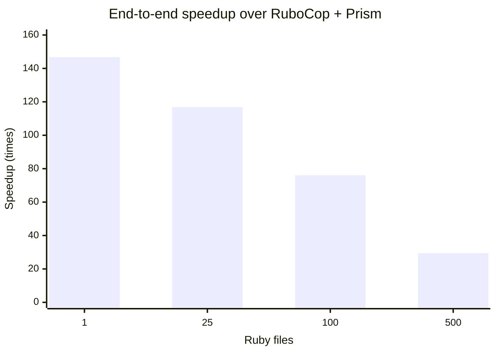

# Performance against RuboCop with Prism

Re-measured after the department/module architecture refactor on 2026-08-18
against RuboCop 1.87.0 and Prism 1.9.0. This is an interim benchmark over the
committed 500-file compatibility corpus and its 20 shared cops. It is not the
final 606-cop benchmark.

Every size was verified by comparing normalized JSON reports before timing.
All four comparisons were identical. Rustocop was built in release mode;
RuboCop was explicitly configured with:

```yaml
AllCops:
  ParserEngine: parser_prism
  TargetRubyVersion: 3.4
  NewCops: enable
```

Both tools ran with caching and server mode disabled and used the JSON
formatter. Timed output was discarded. Commands were alternated between tools,
with 2–3 warmups followed by 7–30 measured runs depending on corpus size.

## Results

| Files | Runs | Rustocop median / p95 | RuboCop + Prism median / p95 | Speedup | JSON parity |
| ---: | ---: | ---: | ---: | ---: | :---: |
| 1 | 30 | 2.803 / 3.349 ms | 411.387 / 432.495 ms | 146.77× | Yes |
| 25 | 20 | 3.623 / 8.091 ms | 423.469 / 434.432 ms | 116.88× | Yes |
| 100 | 12 | 5.730 / 7.213 ms | 435.759 / 445.500 ms | 76.05× | Yes |
| 500 | 7 | 16.514 / 17.921 ms | 485.991 / 488.674 ms | 29.43× | Yes |

## Differential from the pre-refactor run

Negative duration changes are improvements. Since both executables became
faster in this run, the relative speedup is the best control for machine/load
variation.

| Files | Rustocop median | RuboCop + Prism median | Relative speedup |
| ---: | ---: | ---: | ---: |
| 1 | −2.67% | −6.79% | −4.22% |
| 25 | −2.89% | −6.38% | −3.59% |
| 100 | −22.65% | −20.61% | +2.65% |
| 500 | −17.33% | −13.74% | +4.36% |

There is no measurable architecture-refactor regression in this run. The
largest workload improved in both absolute median time and relative speedup.



At 500 files, median throughput was approximately 30,277 files/second for
Rustocop and 1,029 files/second for RuboCop. The corpus is deliberately small—500
files totaling 9,090 bytes—so these figures primarily measure CLI startup,
configuration, parsing, dispatch, and formatter overhead rather than sustained
performance on large application files.

Environment: Apple M5 Pro (15 cores), 24 GB RAM, macOS arm64, Ruby 3.4.9,
Rust 1.96.0. The raw report is generated under
`tmp/performance-verification/rubocop-prism-benchmark.json`.

Reproduce with:

```sh
bundle exec ruby script/benchmark_rubocop_prism.rb
```
