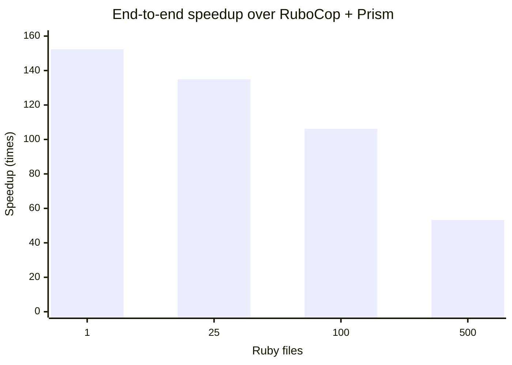

# Performance against RuboCop with Prism

Re-measured after the run-level execution-plan refactor on 2026-08-18
against RuboCop 1.87.0 and Prism 1.9.0. This is an interim benchmark over the
committed 500-file compatibility corpus and its 20 shared cops. It is not the
final 606-cop benchmark.

Every size was verified by comparing normalized JSON reports before timing.
All four comparisons were identical. Rustocop was built in release mode;
RuboCop was explicitly configured with:

```yaml
AllCops:
  ParserEngine: parser_prism
  TargetRubyVersion: 3.4
  NewCops: enable
```

Both tools ran with caching and server mode disabled and used the JSON
formatter. Timed output was discarded. Commands were alternated between tools,
with 2–3 warmups followed by 7–30 measured runs depending on corpus size.

## Results

| Files | Runs | Rustocop median / p95 | RuboCop + Prism median / p95 | Speedup | JSON parity |
| ---: | ---: | ---: | ---: | ---: | :---: |
| 1 | 30 | 2.952 / 4.013 ms | 449.744 / 508.379 ms | 152.35× | Yes |
| 25 | 20 | 3.289 / 3.691 ms | 443.559 / 469.054 ms | 134.86× | Yes |
| 100 | 12 | 4.444 / 4.716 ms | 471.668 / 485.648 ms | 106.14× | Yes |
| 500 | 7 | 9.868 / 11.670 ms | 525.664 / 574.000 ms | 53.27× | Yes |

## Differential from the pre-refactor run

Negative duration changes are improvements. Since both executables became
faster in this run, the relative speedup is the best control for machine/load
variation.

| Files | Rustocop median | RuboCop + Prism median | Relative speedup |
| ---: | ---: | ---: | ---: |
| 1 | +5.32% | +9.32% | +3.80% |
| 25 | −9.22% | +4.74% | +15.38% |
| 100 | −22.44% | +8.24% | +39.57% |
| 500 | −40.24% | +8.16% | +81.01% |

The one-file result remains dominated by startup noise. At 500 files, building
cop selection and the Prism registry once per command, bypassing the textual
line representation for Prism-only runs, and indexing source lines once per
file reduced Rustocop's median by 40.24% despite RuboCop being slower in this
measurement.

## Peak memory

Peak resident memory was measured separately with macOS `/usr/bin/time -l` on
the same files, 20 cops, configuration, JSON formatter, and sequential process
model. Each size had one warmup and seven measured runs, alternating rustocop
and RuboCop. Normalized JSON output was identical before measurement.

| Files | Rustocop sequential median / p95 | Rustocop parallel median / p95 | RuboCop + Prism median / p95 |
| ---: | ---: | ---: | ---: |
| 1 | 2.05 / 2.05 MiB | 2.05 / 2.05 MiB | 87.22 / 88.27 MiB |
| 25 | 2.55 / 2.61 MiB | 2.81 / 2.86 MiB | 87.48 / 88.05 MiB |
| 100 | 3.02 / 3.02 MiB | 3.14 / 3.19 MiB | 87.89 / 89.78 MiB |
| 500 | 3.70 / 3.72 MiB | 4.16 / 4.25 MiB | 89.30 / 92.45 MiB |

The nearly flat curves show that fixed runtime and startup cost dominate this
corpus. At 500 files, automatic parallel execution added about 0.46 MiB over
sequential rustocop and still used less than one twentieth of RuboCop's peak
RSS. This does not imply that arbitrary Ruby
files cost only a few KiB each: the committed corpus totals just 9,090 source
bytes. Large files, large literals, and more complex syntax need a separate
sustained-memory benchmark.

This is a useful baseline for parallelization. A thread pool should retain much
of rustocop's shared process footprint, while adding worker stacks and multiple
simultaneously live Prism trees. A process pool would repeat more of the fixed
footprint per worker. File-level threads are therefore the better first design,
but worker-count defaults should be validated on a corpus of realistically sized
application files rather than inferred from this small fixture set.

Reproduce the memory measurement with:

```sh
bundle exec ruby script/benchmark_memory.rb
```

The raw report is written to
`tmp/performance-verification/memory-benchmark.json`.

## File-level parallelization

`--parallel` uses the machine's available CPU count; `--jobs N` sets a fixed
worker count. The runner assigns complete files to scoped threads and restores
discovery order before formatting. Sequential and every parallel variant below
produced byte-identical JSON.

| Files | Sequential | 2 workers | 4 workers | 8 workers | Automatic |
| ---: | ---: | ---: | ---: | ---: | ---: |
| 25 | 3.062 ms | 2.977 ms / 1.03× | 3.227 ms / 0.95× | 3.184 ms / 0.96× | 3.189 ms / 0.96× |
| 100 | 3.626 ms | 3.509 ms / 1.03× | 3.080 ms / 1.18× | 3.516 ms / 1.03× | 3.639 ms / 1.00× |
| 500 | 8.875 ms | 7.751 ms / 1.15× | 7.054 ms / 1.26× | 7.884 ms / 1.13× | 7.795 ms / 1.14× |

The execution plan removed enough serial per-file work that parallelism now has
less to recover: four workers are fastest at 500 files (1.26×), while automatic
mode provides 1.14×. At 25 tiny files, worker startup outweighs useful work.
Parallel mode remains opt-in so small invocations do not pay that overhead.

Reproduce with:

```sh
bundle exec ruby script/benchmark_parallel.rb
```

The raw report is written to
`tmp/performance-verification/parallel-benchmark.json`.

## Timing interpretation



At 500 files, median throughput was approximately 50,669 files/second for
Rustocop and 951 files/second for RuboCop. The corpus is deliberately small—500
files totaling 9,090 bytes—so these figures primarily measure CLI startup,
configuration, parsing, dispatch, and formatter overhead rather than sustained
performance on large application files.

Environment: Apple M5 Pro (15 cores), 24 GB RAM, macOS arm64, Ruby 3.4.9,
Rust 1.96.0. The raw report is generated under
`tmp/performance-verification/rubocop-prism-benchmark.json`.

Reproduce with:

```sh
bundle exec ruby script/benchmark_rubocop_prism.rb
```
