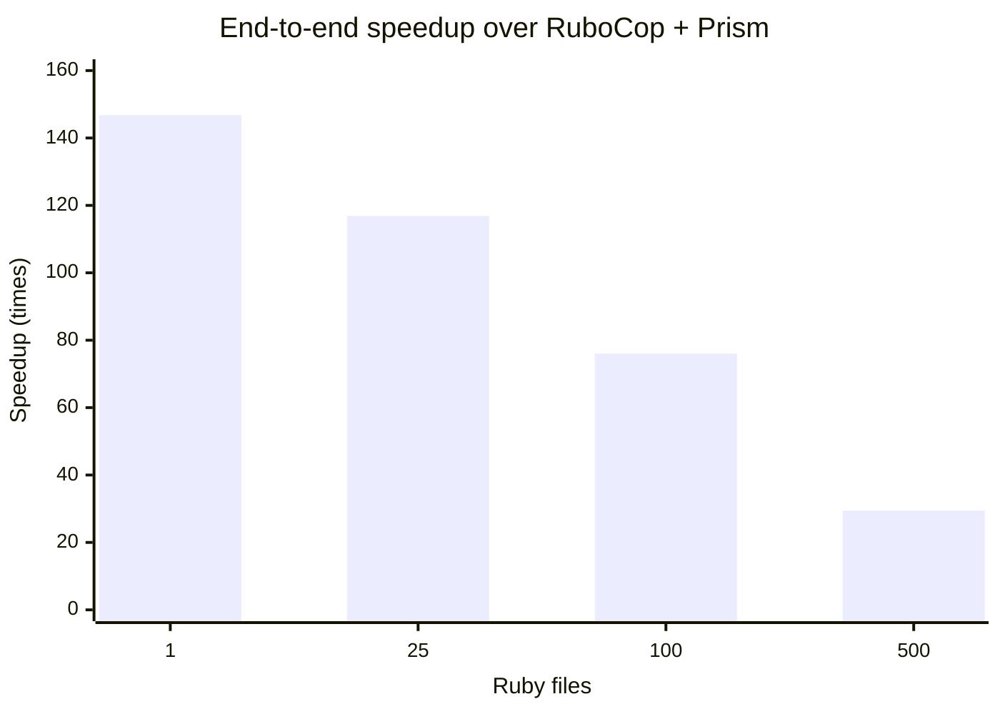

# Performance against RuboCop with Prism

Re-measured after the department/module architecture refactor on 2026-08-18
against RuboCop 1.87.0 and Prism 1.9.0. This is an interim benchmark over the
committed 500-file compatibility corpus and its 20 shared cops. It is not the
final 606-cop benchmark.

Every size was verified by comparing normalized JSON reports before timing.
All four comparisons were identical. Rustocop was built in release mode;
RuboCop was explicitly configured with:

```yaml
AllCops:
  ParserEngine: parser_prism
  TargetRubyVersion: 3.4
  NewCops: enable
```

Both tools ran with caching and server mode disabled and used the JSON
formatter. Timed output was discarded. Commands were alternated between tools,
with 2–3 warmups followed by 7–30 measured runs depending on corpus size.

## Results

| Files | Runs | Rustocop median / p95 | RuboCop + Prism median / p95 | Speedup | JSON parity |
| ---: | ---: | ---: | ---: | ---: | :---: |
| 1 | 30 | 2.803 / 3.349 ms | 411.387 / 432.495 ms | 146.77× | Yes |
| 25 | 20 | 3.623 / 8.091 ms | 423.469 / 434.432 ms | 116.88× | Yes |
| 100 | 12 | 5.730 / 7.213 ms | 435.759 / 445.500 ms | 76.05× | Yes |
| 500 | 7 | 16.514 / 17.921 ms | 485.991 / 488.674 ms | 29.43× | Yes |

## Differential from the pre-refactor run

Negative duration changes are improvements. Since both executables became
faster in this run, the relative speedup is the best control for machine/load
variation.

| Files | Rustocop median | RuboCop + Prism median | Relative speedup |
| ---: | ---: | ---: | ---: |
| 1 | −2.67% | −6.79% | −4.22% |
| 25 | −2.89% | −6.38% | −3.59% |
| 100 | −22.65% | −20.61% | +2.65% |
| 500 | −17.33% | −13.74% | +4.36% |

There is no measurable architecture-refactor regression in this run. The
largest workload improved in both absolute median time and relative speedup.

## Peak memory

Peak resident memory was measured separately with macOS `/usr/bin/time -l` on
the same files, 20 cops, configuration, JSON formatter, and sequential process
model. Each size had one warmup and seven measured runs, alternating rustocop
and RuboCop. Normalized JSON output was identical before measurement.

| Files | Rustocop sequential median / p95 | Rustocop parallel median / p95 | RuboCop + Prism median / p95 |
| ---: | ---: | ---: | ---: |
| 1 | 2.05 / 2.05 MiB | 2.05 / 2.05 MiB | 87.22 / 88.27 MiB |
| 25 | 2.55 / 2.61 MiB | 2.81 / 2.86 MiB | 87.48 / 88.05 MiB |
| 100 | 3.02 / 3.02 MiB | 3.14 / 3.19 MiB | 87.89 / 89.78 MiB |
| 500 | 3.70 / 3.72 MiB | 4.16 / 4.25 MiB | 89.30 / 92.45 MiB |

The nearly flat curves show that fixed runtime and startup cost dominate this
corpus. At 500 files, automatic parallel execution added about 0.46 MiB over
sequential rustocop and still used less than one twentieth of RuboCop's peak
RSS. This does not imply that arbitrary Ruby
files cost only a few KiB each: the committed corpus totals just 9,090 source
bytes. Large files, large literals, and more complex syntax need a separate
sustained-memory benchmark.

This is a useful baseline for parallelization. A thread pool should retain much
of rustocop's shared process footprint, while adding worker stacks and multiple
simultaneously live Prism trees. A process pool would repeat more of the fixed
footprint per worker. File-level threads are therefore the better first design,
but worker-count defaults should be validated on a corpus of realistically sized
application files rather than inferred from this small fixture set.

Reproduce the memory measurement with:

```sh
bundle exec ruby script/benchmark_memory.rb
```

The raw report is written to
`tmp/performance-verification/memory-benchmark.json`.

## File-level parallelization

`--parallel` uses the machine's available CPU count; `--jobs N` sets a fixed
worker count. The runner assigns complete files to scoped threads and restores
discovery order before formatting. Sequential and every parallel variant below
produced byte-identical JSON.

| Files | Sequential | 2 workers | 4 workers | 8 workers | Automatic |
| ---: | ---: | ---: | ---: | ---: | ---: |
| 25 | 3.195 ms | 2.937 ms / 1.09× | 2.894 ms / 1.10× | 2.983 ms / 1.07× | 3.021 ms / 1.06× |
| 100 | 5.094 ms | 4.292 ms / 1.19× | 3.484 ms / 1.46× | 3.631 ms / 1.40× | 3.762 ms / 1.35× |
| 500 | 18.034 ms | 12.659 ms / 1.42× | 8.954 ms / 2.01× | 8.586 ms / 2.10× | 8.087 ms / 2.23× |

The 500-file corpus improved by 2.23× in automatic mode while adding little
resident memory. At 25 tiny files, gains were negligible because thread startup
and fixed CLI work dominate. Parallel mode remains opt-in so small invocations
do not pay that overhead by default.

Reproduce with:

```sh
bundle exec ruby script/benchmark_parallel.rb
```

The raw report is written to
`tmp/performance-verification/parallel-benchmark.json`.

## Timing interpretation



At 500 files, median throughput was approximately 30,277 files/second for
Rustocop and 1,029 files/second for RuboCop. The corpus is deliberately small—500
files totaling 9,090 bytes—so these figures primarily measure CLI startup,
configuration, parsing, dispatch, and formatter overhead rather than sustained
performance on large application files.

Environment: Apple M5 Pro (15 cores), 24 GB RAM, macOS arm64, Ruby 3.4.9,
Rust 1.96.0. The raw report is generated under
`tmp/performance-verification/rubocop-prism-benchmark.json`.

Reproduce with:

```sh
bundle exec ruby script/benchmark_rubocop_prism.rb
```
