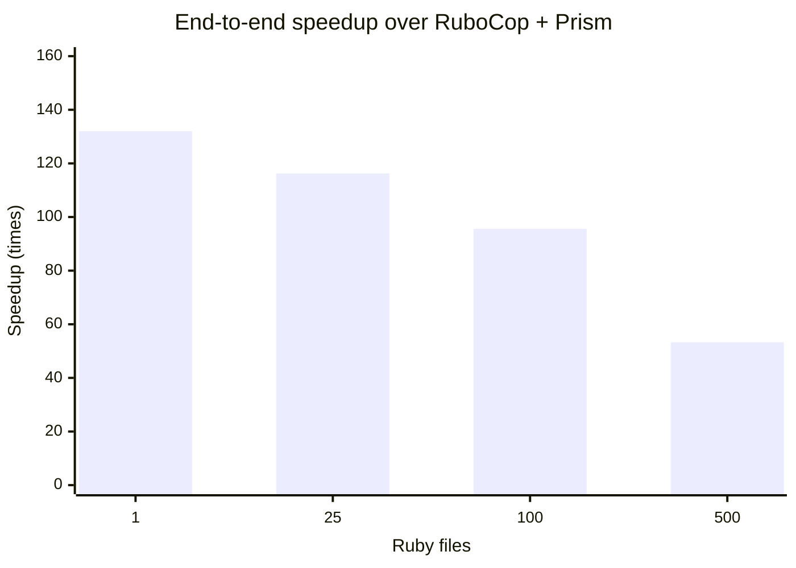

# Performance against RuboCop with Prism

Re-measured on 2026-08-19 against RuboCop 1.87.0 and Prism 1.9.0. This benchmark
uses the committed 500-file compatibility corpus and 20 shared verified cops;
it measures a representative local feedback path, not all 606 cops at once.

Every size was verified by comparing normalized JSON reports before timing.
Both tools were identical at every size. Rustocop was built in release mode;
RuboCop explicitly selected Prism to keep the benchmark configuration stable:

```yaml
AllCops:
  ParserEngine: parser_prism
  TargetRubyVersion: 3.4
  NewCops: enable
```

Both tools ran with caching and server mode disabled and used the JSON
formatter. Timed output was discarded. Commands were alternated, with 2–3
warmups followed by 7–30 measured runs depending on corpus size.

## Results

| Files | Runs | Rustocop median / p95 | RuboCop Prism median / p95 | Speedup |
| ---: | ---: | ---: | ---: | ---: |
| 1 | 30 | 3.016 / 3.272 ms | 398.116 / 409.436 ms | 132.00× |
| 25 | 20 | 3.460 / 3.886 ms | 402.181 / 409.257 ms | 116.24× |
| 100 | 12 | 4.331 / 4.551 ms | 414.004 / 417.533 ms | 95.59× |
| 500 | 7 | 8.957 / 9.641 ms | 477.107 / 479.103 ms | 53.27× |

## Interpretation

The one-file result is dominated by process startup. At 500 files, rustocop is
about 53 times faster than RuboCop. The benchmark does not show that parsing
itself is 53 times faster: this tiny corpus measures the complete CLI,
configuration, file, traversal, and formatting paths together.

## Peak memory

Peak resident memory was measured separately with macOS `/usr/bin/time -l` on
the same files, 20 cops, configuration, JSON formatter, and sequential process
model. Each size had one warmup and seven measured runs, alternating rustocop
and RuboCop. Normalized JSON output was identical before measurement.

| Files | Rustocop sequential median / p95 | Rustocop parallel median / p95 | RuboCop + Prism median / p95 |
| ---: | ---: | ---: | ---: |
| 1 | 2.05 / 2.05 MiB | 2.05 / 2.05 MiB | 87.22 / 88.27 MiB |
| 25 | 2.55 / 2.61 MiB | 2.81 / 2.86 MiB | 87.48 / 88.05 MiB |
| 100 | 3.02 / 3.02 MiB | 3.14 / 3.19 MiB | 87.89 / 89.78 MiB |
| 500 | 3.70 / 3.72 MiB | 4.16 / 4.25 MiB | 89.30 / 92.45 MiB |

The nearly flat curves show that fixed runtime and startup cost dominate this
corpus. At 500 files, automatic parallel execution added about 0.46 MiB over
sequential rustocop and still used less than one twentieth of RuboCop's peak
RSS. This does not imply that arbitrary Ruby
files cost only a few KiB each: the committed corpus totals just 9,090 source
bytes. Large files, large literals, and more complex syntax need a separate
sustained-memory benchmark.

This is a useful baseline for parallelization. A thread pool should retain much
of rustocop's shared process footprint, while adding worker stacks and multiple
simultaneously live Prism trees. A process pool would repeat more of the fixed
footprint per worker. File-level threads are therefore the better first design,
but worker-count defaults should be validated on a corpus of realistically sized
application files rather than inferred from this small fixture set.

Reproduce the memory measurement with:

```sh
bundle exec ruby script/benchmark_memory.rb
```

The raw report is written to
`tmp/performance-verification/memory-benchmark.json`.

## File-level parallelization

`--parallel` uses the machine's available CPU count; `--jobs N` sets a fixed
worker count. The runner assigns complete files to scoped threads and restores
discovery order before formatting.

On 30,894 GitLab Ruby files (103.5 MB) with warm filesystem caches and 20
verified cops, one worker took 2,303 ms, 8 took 704 ms, the automatic 15 took
572 ms, and 24 took 564 ms. Results were effectively flat from 18 through 128
workers; 256 regressed slightly to 571 ms. On this 15-core machine, automatic
parallelism is a sound default and 18–24 workers is the useful manual range.
Using 48 or more workers adds pressure without meaningful throughput.

See [Known performance bottlenecks](bottlenecks.md) for the measured sweep and
[real-project benchmarks](../benchmark/project-benchmarks.md) for the pinned
project methodology.

## Timing interpretation



At 500 files, median throughput was approximately 55,822 files/second for
Rustocop and 1,048 for RuboCop with Prism. The corpus is deliberately small—500
files totaling 9,090 bytes—so these figures primarily measure CLI startup,
configuration, parsing, dispatch, and formatter overhead rather than sustained
performance on large application files.

Environment: Apple M5 Pro (15 cores), 24 GB RAM, macOS arm64, Ruby 3.4.9,
Rust 1.96.0. The raw report is generated under
`tmp/performance-verification/rubocop-prism-benchmark.json`.

Reproduce with:

```sh
bundle exec ruby script/benchmark_rubocop_prism.rb
```
